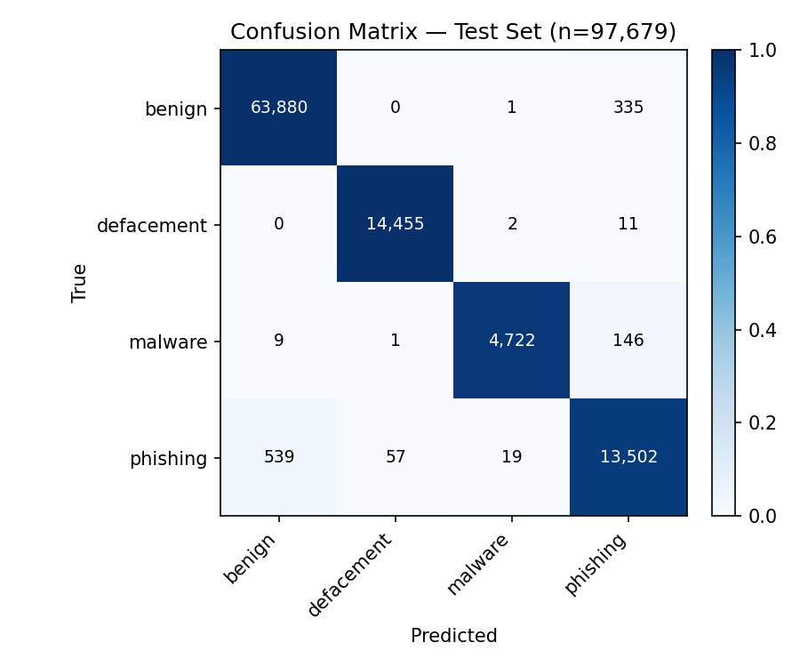

# Malicious URL Detection with DistilBERT

A transformer-based NLP system that classifies URLs into four categories — **benign**, **phishing**, **malware**, and **defacement** — by fine-tuning **DistilBERT** directly on raw URL strings, with no handcrafted feature engineering. The model achieves **98.85% accuracy** on a held-out test set of ~97K URLs.

🤗 **Pretrained weights:** [najlajj453/malicious-url-distilbert](https://huggingface.co/najlajj453/malicious-url-distilbert) on Hugging Face — use the model directly without training it yourself.

## Project Structure

```
GP-Malicious-URL-Detection/
├── app.py               # Gradio web UI (python app.py)
├── src/
│   ├── config.py        # All hyperparameters, paths, and constants
│   ├── data.py          # Loading, stratified splitting, labels, tokenization
│   ├── train.py         # Fine-tuning pipeline (python -m src.train)
│   ├── evaluate.py      # Test-set metrics + confusion matrix
│   ├── calibrate.py     # Temperature scaling for confidence calibration
│   ├── predict.py       # Calibrated inference + "uncertain" band (CLI)
│   ├── cross_eval.py    # Out-of-distribution evaluation on external data
│   ├── benchmark.py     # Latency benchmark (ms/URL, CPU vs GPU)
│   ├── adversarial.py   # Robustness spot-check (homoglyph/typosquat/padding)
│   └── visualize.py     # Class-distribution & confusion-matrix figures
├── tests/               # Unit tests (run in CI, no model/dataset needed)
├── notebooks/
│   └── NLP_Project.ipynb    # Original research notebook
├── docs/
│   ├── paper.pdf            # IEEE-format project paper
│   ├── presentation.pdf     # Project presentation
│   └── TECHNICAL_REPORT.md  # Detailed analysis & recommendations
├── data/                # Place malicious_phish.csv here (not tracked by git)
├── models/              # Fine-tuned model artifacts saved here
├── requirements.txt
└── README.md
```

## How It Works

1. **Dataset** — the [Malicious URLs Dataset (Kaggle)](https://www.kaggle.com/datasets/sid321axn/malicious-urls-dataset): ~651,000 labeled URLs across 4 classes.
2. **Split** — stratified 70% train / 15% validation / 15% test (fixed seed 42), preserving class proportions in every split.
3. **Tokenization** — URLs are treated as text and encoded with the DistilBERT WordPiece tokenizer (max 64 tokens). No manual feature extraction.
4. **Model** — `distilbert-base-uncased` + a 4-way classification head (~40% fewer parameters than BERT, well suited to short sequences).
5. **Training** — 3 epochs, AdamW, learning rate 2e-5, batch size 16, weight decay 0.01, via the HuggingFace `Trainer` API.
6. **Inference** — an interactive tool classifies any URL in real time and reports a confidence score.

## Results

Confirmed on this exact checkpoint via `python -m src.evaluate` (held-out 15% test split, 97,679 URLs):

| Class      | Precision | Recall | F1-Score | Support |
|------------|-----------|--------|----------|---------|
| Benign     | 0.9915    | 0.9948 | 0.9931   | 64,216  |
| Defacement | 0.9960    | 0.9991 | 0.9976   | 14,468  |
| Malware    | 0.9954    | 0.9680 | 0.9815   | 4,878   |
| Phishing   | 0.9648    | 0.9564 | 0.9606   | 14,117  |
| **Macro Avg** | **0.9869** | **0.9796** | **0.9832** | 97,679 |

**Overall test accuracy: 98.85%**

## Setup

### 1. Environment

```bash
git clone https://github.com/najla-jaashan/GP-Malicious-URL-Detection.git
cd GP-Malicious-URL-Detection

# Windows (PowerShell)
py -m venv .venv
.venv\Scripts\Activate.ps1
py -m pip install --upgrade pip
py -m pip install -r requirements.txt

# macOS / Linux
python3 -m venv .venv
source .venv/bin/activate
pip install --upgrade pip
pip install -r requirements.txt
```

On Windows, use `py` (not `python`) unless `python` is already on your PATH.
If PowerShell blocks the activation script, run once:
`Set-ExecutionPolicy -Scope CurrentUser -ExecutionPolicy RemoteSigned`

**Training needs a GPU.** `distilbert-base-uncased` fine-tuning on ~455K URLs
for 3 epochs takes minutes on a free Colab T4, but is impractical on a laptop
CPU (order of days, not hours). Train on Colab, then copy the resulting
`models/distilbert-url-classifier/` folder here — CPU is fine for inference,
evaluation, and the web UI.

### 2. Get the model — download pretrained (fast) or train it yourself

**Option A — download the pretrained weights (recommended, no GPU needed):**

```bash
py -m pip install huggingface_hub   # if not already installed
hf download najlajj453/malicious-url-distilbert --local-dir models/distilbert-url-classifier
```

This gets you straight to Step 5 (Evaluate) or Step 6 (Predict) — no dataset
download or training required.

**Option B — train it yourself:** continue with the Dataset and Train steps below.

### 3. Dataset (only needed if training)

Download `malicious_phish.csv` from the [Kaggle dataset page](https://www.kaggle.com/datasets/sid321axn/malicious-urls-dataset) and place it in `data/`.

### 4. Train

```bash
py -m src.train          # Windows
python -m src.train      # macOS / Linux
```

Saves the fine-tuned model, tokenizer, and label map to `models/distilbert-url-classifier/`.

### 5. Evaluate

```bash
py -m src.evaluate          # Windows
python -m src.evaluate      # macOS / Linux
```

Prints the per-class metrics table and a confusion matrix on the held-out test split.

### 6. Predict

```bash
# Interactive loop
py -m src.predict

# Or classify URLs directly
py -m src.predict "http://secure-login.paypa1-account.example/verify"
```

Predictions below the confidence threshold (`config.UNCERTAIN_THRESHOLD`,
default 0.60) are reported as **uncertain** rather than force-classified.

### 7. Web UI

```bash
py app.py          # Windows
python app.py       # macOS / Linux
```

Launches a Gradio interface (with a temporary public share link) where you
enter a URL and see the verdict, confidence, and full class-probability bars.
The app reuses `src/predict.py`, so labels and behavior stay in sync with the
trained model automatically.

## Additional Tooling

| Command | Purpose |
|---|---|
| `python -m src.calibrate` | Fit temperature scaling on the validation set; writes `temperature.json` and reports Expected Calibration Error before/after. |
| `python -m src.cross_eval external.csv` | Evaluate on an **independent** labelled URL CSV to measure the generalization gap. |
| `python -m src.benchmark` | Report inference latency (mean/p50/p95 ms per URL) on CPU and GPU. |
| `python -m src.adversarial` | Spot-check robustness to homoglyph, typosquat, and subdomain-padding evasions of benign URLs. |
| `python -m src.visualize --confusion` | Save the test-set confusion matrix to `docs/confusion_matrix.png`. |

## Confusion Matrix



Rows are true classes, columns are predicted. The largest error is
phishing→benign (539 cases) — the highest-stakes mistake type, since it
represents an actual phishing URL being waved through as safe. Malware's
errors skew toward phishing (146 of 156 total) rather than benign, suggesting
the two share obfuscation patterns the model sometimes conflates.

To regenerate after retraining:
```bash
python -m src.visualize --confusion
```

## Disclaimer

This model is a research prototype. Predictions should not be treated as a guarantee that a URL is safe; use it as one signal within a layered security workflow.
